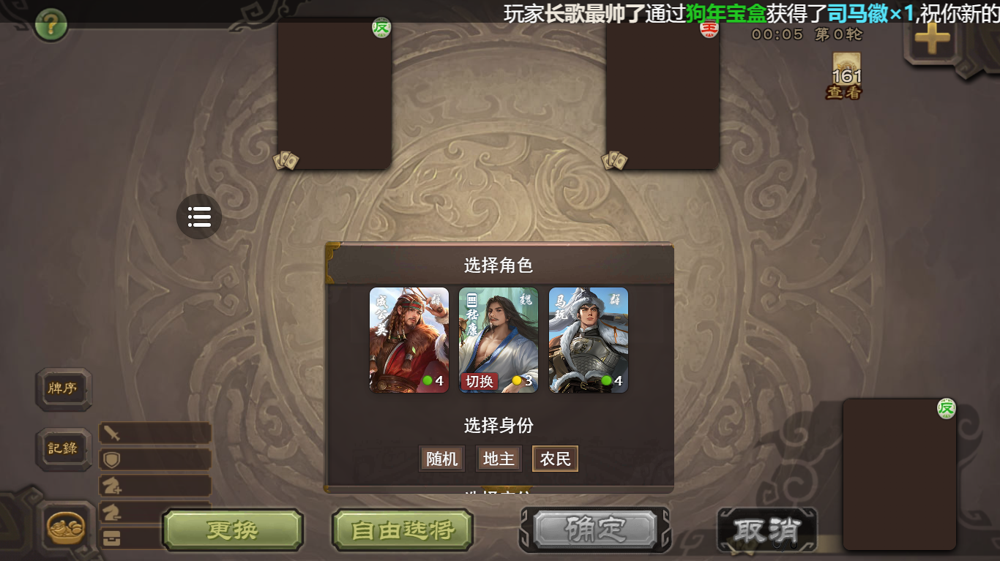
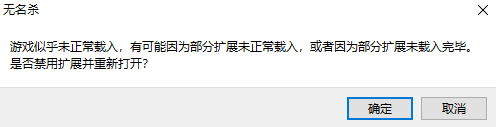
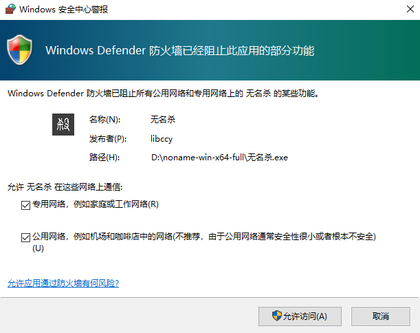
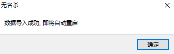

### 完整版效果截图

### 一、无名杀介绍

无名杀是一款基于GPLv3协议，使用HTML+JS+CSS制作的一款开源卡牌游戏

最初由[水乎](https://github.com/libccy)制作，目前由[诗笺](https://github.com/nonameShijian)主导更新

主要交流平台——无名杀GitHub官网；百度贴吧：无名杀吧（现吧主：诗笺）；无名杀QQ群、QQ频道、微信公众号等

### 二、项目简介

本项目将无名杀和部分扩展进行整合，为新人制作简单易用的无名杀懒人包，使新人得以快速体验无名杀

默认样式为老手杀，项目会尽力还原其样式，也可自行修改为您想要的格式~~但是因为我不进行测试，可能遇到奇怪Bug~~

此项目完全免费，不做任何商业用途，资源来自网络，转载时请附上Github原链接及我的名字（武侠Tux或WuXiaTux）

### 三、项目必知

#### 1.此项目支持的系统版本

目前完整支持Windows 10及以上的64位系统，32位系统仅提供部分支持，Win 7用户请安装[VxKex-NEXT](https://github.com/YuZhouRen86/VxKex-NEXT/)
或[VxKex原版](https://github.com/i486/VxKex/releases)以支持无名杀使用的Electron框架

#### 2.此项目各版本的区别

noname后接懒人包自带本体对应版本号

标有“-win”为支持Windows系统的版本

标有“-x64”为支持64位系统的版本

标有“-x32”为支持32位系统的版本

标有“-full”为完整版，存储占用高，安装千幻聆音、全能搜索、十周年UI、皮肤切换和无名美化扩展，还原手杀程度较高

由于Github Release限制单文件最多上传2GB，这里将完整版分割为了几个.00X文件，安装完整版时请下载全部此类文件，然后使用解压软件打开其中一个，就可以解压了

标有“-light”为轻量版，存储占用较少，仅保留全能搜索和十周年UI扩展进行简单美化

标有“-origin”为无名杀原版，仅含有启动器+无名杀本体，不含有任何扩展

PDF文件为无名杀全教程，给萌新入门学习使用，将里面的内容全部学会就可以不需要懒人包并且学会部分无名杀代码了，虽然里面有些内容有点过时，但是大部分仍可以提供给萌新学习

#### 3.本项目的安装方法

Windows版的轻量版和无名杀原版目前无需安装，下载项目Release中的Windows版压缩包，解压压缩包中的文件夹后打开文件夹内的“无名杀.exe”即可使用，解压密码为noname

因为Github Release的限制，完整版只能通过分割文件发出，请合并解压，[合并教程](https://zhuanlan.zhihu.com/p/13606016443)，解压密码为noname

#### 4.注意项

#### 重要！！！ 打开程序时可能会出现下面的情况，此时请一定要点击“取消”，否则无论轻量版或完整版都会直接变为无名杀原版的样式，移除所有美化！

#### 若你已经点击了“确定”，有两种方法恢复
#### 第一种：解压对应版本压缩包中noname-xxx/resources/app/noname.config.txt，打开无名杀，点击左上角的“选项”，选择“选项-其他-导入游戏设置”，导入该文件，程序自动重启后就会重新导入数据了
#### 第二种：复制对应版本压缩包中noname-xxx/resources/app/noname.config.txt，放入无名杀解压目录中的resources/app/，然后打开无名杀，根据提示重启，就会重新导入数据了

(1)懒人包在第一次打开时会要求程序通过防火墙，请勾选所有单选框，然后点击“允许访问”

(2)第一次启动时会导入设置项，请等待程序出现下面的提示，点击确定重启后就可以使用懒人包了

(3)下载速度慢？可查看[此篇文章](https://www.cnblogs.com/wuxiatux/p/18358288)或使用下载器（如[IDM](https://www.internetdownloadmanager.com)、[Mortix](https://motrix.app)等）解决！

#### 5.此项目使用的项目和扩展

使用此[贴吧链接](https://tieba.baidu.com/p/9082412439)提供的无名杀数据包、由理版启动器、千幻聆音、全能搜索、皮肤切换和无名美化扩展

使用[点点二改十周年UI](https://github.com/diandian157/dceadeUIX)扩展

[无名杀本体下载地址](https://github.com/libnoname/noname/releases)

[无名杀各种启动器的官方下载地址](https://github.com/libnoname/noname/releases/tag/chromium91-client)

[原千幻聆音扩展地址](https://github.com/1429825668/qianhuan)

[原十周年UI扩展地址](https://github.com/Tipx-L/decade-ui)

### 四、项目反馈

如果本项目出现任何错误，请提交[Issue](https://github.com/WuXiaTux/noname-for-dummies/issues)或访问[我的B站](https://space.bilibili.com/2129765923)进行留言

### 五、感谢

感谢贴吧[PZ_157](https://tieba.baidu.com/home/main?id=tb.1.3a25cf56.eqZjEs2SL3m-7wuS1aHw0w?t=1625216815&fr=pb)整理的无名杀相关文件

感谢[水乎（已退坑）](https://github.com/libccy)、[苏婆玛丽奥（已退坑）](https://github.com/Spmario233)、[诗笺](https://github.com/nonameShijian)等更新无名杀的所有大佬

感谢本项目使用的扩展作者

感谢编写《无名杀全教程》的大佬们

### 六、无名杀官方README

noname-server.exe 的源码见以下仓库：

https://github.com/nonameShijian/noname-server

---

贡献代码可阅读相关文档：

[Git 下载安装指南](https://github.com/libnoname/noname/wiki/Git%E4%B8%8B%E8%BD%BD%E5%AE%89%E8%A3%85%E6%8C%87%E5%8D%97)

[Github 桌面版客户端使用入门](https://docs.github.com/zh/desktop/overview/getting-started-with-github-desktop)

[如何提交代码到《无名杀》Github 仓库](https://github.com/libnoname/noname/wiki/%E5%A6%82%E4%BD%95%E6%8F%90%E4%BA%A4%E4%BB%A3%E7%A0%81%E5%88%B0%E3%80%8A%E6%97%A0%E5%90%8D%E6%9D%80%E3%80%8BGithub%E4%BB%93%E5%BA%93)

[《无名杀》项目 Pull Request 提交规范](https://github.com/libnoname/noname/wiki/%E3%80%8A%E6%97%A0%E5%90%8D%E6%9D%80%E3%80%8B%E9%A1%B9%E7%9B%AE-Pull-Request-%E6%8F%90%E4%BA%A4%E8%A7%84%E8%8C%83)

客户端下载戳这里：

GitHub： https://github.com/libnoname/noname/releases/tag/chromium91-client

网页端推荐使用 Chrome 系内核浏览器游玩，不推荐使用低版本 Firefox 浏览器

请尽量保证游玩的 Chrome 系浏览器或手机 Webview 的`内核版本大于等于91`

提交 Pull Request 时请推送到"PR-Branch"分支！

---

最近有一伙人号称是《无名杀十周年》的开发团队，宣称《无名杀十周年》“全新无名杀，比旧版拥有更多武将，兼容更多扩展”，实际上:

- 《无名杀十周年》（原《无名杀清瑶版》）由无名杀 v1.9.124 修改而来，属于无名杀的一种**Fork**，并非“全新无名杀”；且《无名杀十周年》开发团队**公然违反 GPL-3.0 协议**，详情请看[这里](https://github.com/github/dmca/blob/master/2023/09/2023-09-20-noname.md)、[这里](https://tieba.baidu.com/p/8623890806)以及[这里](https://tieba.baidu.com/p/8624582238)。
- 《无名杀十周年》至今没有更新神典韦等新机制武将，且删除了部分无名杀的原创武将，导致《无名杀十周年》的武将数量远远不及无名杀前几个版本的武将数量；不仅如此，《无名杀十周年》自分裂后的部分武将源码依然来自无名杀和其他开发者开源的代码。
- 《无名杀十周年》兼容扩展的方式是不更新本体数据，从而导致《无名杀十周年》仍然在用 1.9.124 版本的代码，无法兼容使用 1.10 以后功能的扩展；而且《无名杀十周年》开发团队在使用**大量**GPL-3.0 开源的代码后对生成产物进行了**混淆加密**，在**违反开源精神**的同时，也导致扩展稳定性极具下降，更容易出问题。

《无名杀十周年》就是彻头彻尾的骗局，《无名杀十周年》的开发团队更是一群拿无名杀吸血的骗子，虽然号称“不忘初心”，却公然对最有资格论述无名杀创作初心的无名杀创始人进行侮辱谩骂，直接违背其制定的规则和开源精神，恶劣程度远超当初在多个无名杀社群“自立”的水叶之流。

先秦介子推曾言：“窃人之财，犹谓之盗，况贪天之功以为己力乎。”无名杀社区发展至今，正是因为有大量的开源代码进行参考，才能不断推陈出新。试想每个扩展开发者在成为一个扩展开发者之前，谁敢说没有大量参考社区内的源码？每个作品凝聚的都是大家的心血，而不是仅仅归属于个别人。我们相信：开放、共享、多元才是无名杀的初心，绝不是封闭、私藏与趋同。

我们在此呼吁无名杀社区正确认识《无名杀十周年》开发团队的一些行为与做法，并希望《无名杀十周年》开发团队能反省迄今以来的所作所为。**自由开源**是无名杀社区的灵魂，希望各方都能够遵循这一精神。
